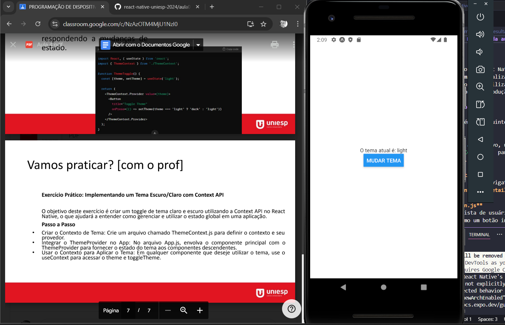
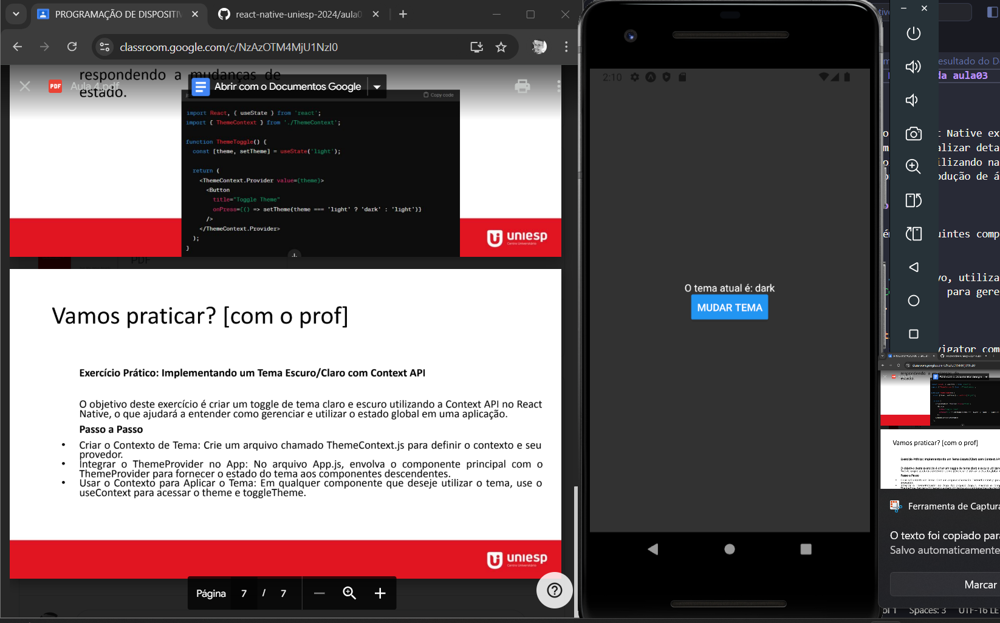

# Resultado do Desafio da aula04
# Uso do App

Este aplicativo em React Native muda o tema da tela ao ser clicado no botao **MUDAR TEMA** de acordo com o thema atual.

## Exemplo com imagens
- Tema claro

- Tema escuro

