# Study-app 

Este projeto é uma aplicação para gerenciamento de cartões de estudo, permitindo aos usuários criar, editar e visualizar cartões de estudo organizados por vencimento. Também possui funcionalidades de autenticação para garantir que cada usuário tenha acesso seguro aos seus próprios dados.

---

## Estrutura do Projeto

Abaixo está a arquitetura do projeto, com a explicação de cada diretório e arquivo:

### Diretórios na Raiz  
- **.expo/**: Contém configurações específicas do Expo para o projeto.  
- **.idea/**: Diretório gerado pelo ambiente de desenvolvimento (geralmente pelo IntelliJ ou Android Studio), usado para armazenar configurações do projeto.  
- **assets/**  
  - **logo.png**: Imagem utilizada no projeto, como logotipo.  
- **node_modules/**: Diretório que armazena todas as dependências instaladas via npm ou yarn.  

### Arquivos na Raiz  
- **.env**: Arquivo para configuração de variáveis de ambiente.  
- **env.example**: Exemplo de configuração de variáveis de ambiente, usado como referência.  
- **.gitignore**: Arquivo que especifica quais arquivos ou pastas devem ser ignorados pelo Git.  
- **App.js**: Arquivo principal do aplicativo, onde a navegação ou lógica geral é configurada.  
- **app.json**: Configuração do projeto Expo, como nome, ícone, e outras propriedades.  
- **babel.config.js**: Configuração do Babel, que transpila o código para uma versão mais compatível com navegadores ou ambientes.  
- **eas.json**: Configurações para o Expo Application Services (EAS), utilizado para builds e deploys no Expo.  
- **package-lock.json**: Detalhes exatos das dependências instaladas, gerado automaticamente pelo npm.  
- **package.json**: Arquivo que lista as dependências do projeto, scripts e informações básicas.  

### Diretórios e Arquivos no `src`  
- **src/config/**  
  - **firebaseConfig.js**: Contém a configuração de conexão com o Firebase.  
- **src/contexts/**  
  - **AuthContext.js**: Define o contexto de autenticação, usado para gerenciar o estado do usuário logado.  
  - **CartoesEstudoContext.js**: Contexto para gerenciar os cartões de estudo.  
- **src/screens/**  
  - **EdicaoCartaoScreen.js**: Tela para editar os cartões de estudo.  
  - **ListaCartaoScreen.js**: Tela que exibe a lista de cartões de estudo.  
  - **LoginScreen.js**: Tela de login, onde o usuário pode autenticar-se.  
  - **RegistroScreen.js**: Tela para registro de novos usuários.  
  - **TarefaVencimentoProximoScreen.js**: Tela que exibe tarefas com vencimentos próximos.  

## Tela Inicial

Abaixo está uma captura de tela da tela inicial do aplicativo, mostrando a interface do usuário e as opções disponíveis ao abrir o aplicativo. A tela inicial fornece um acesso rápido às funcionalidades principais, como login e registro.

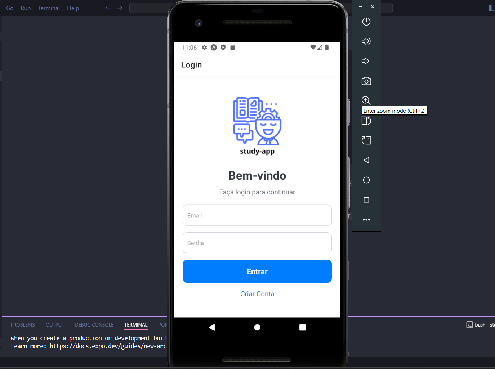

## Tela de Cadastro

A tela de cadastro permite que o usuário crie uma conta no aplicativo. Ela contém os seguintes elementos:
- **Campos de entrada** e-mail e senha.
- **Validação de campos**: Ao preencher o formulário, os campos são validados.
- **Botões** para enviar o formulário e ser direcionado para tela principa ldo aplicativo, caso o usuário já tenha uma conta uma mensagem será exibida na tela.

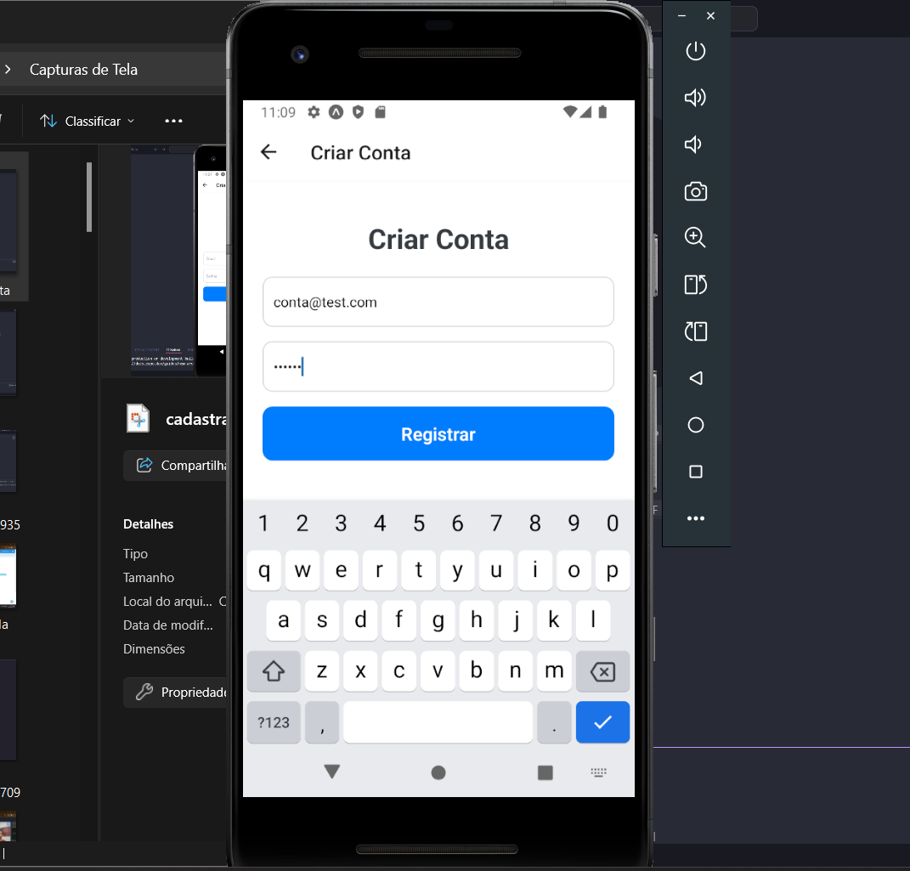

## Tela Conta Cadastrada

A tela exibe uma mensagem de que a conta foi criada com sucesso e direciona o usuario para a tela principal do App.

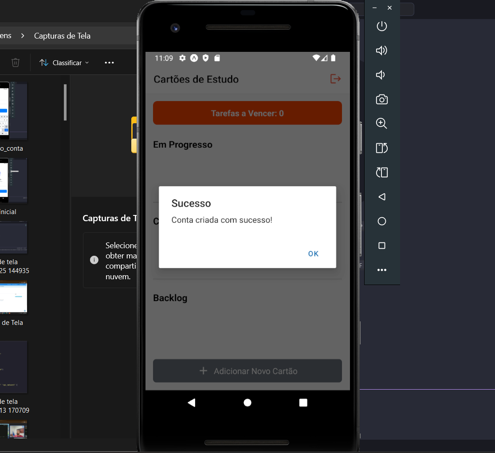

## Tela se já Possuir Cadastro

A tela exibe uma mensagem caso tente fazer o cadastro e já possuir conta com o mesmo email.

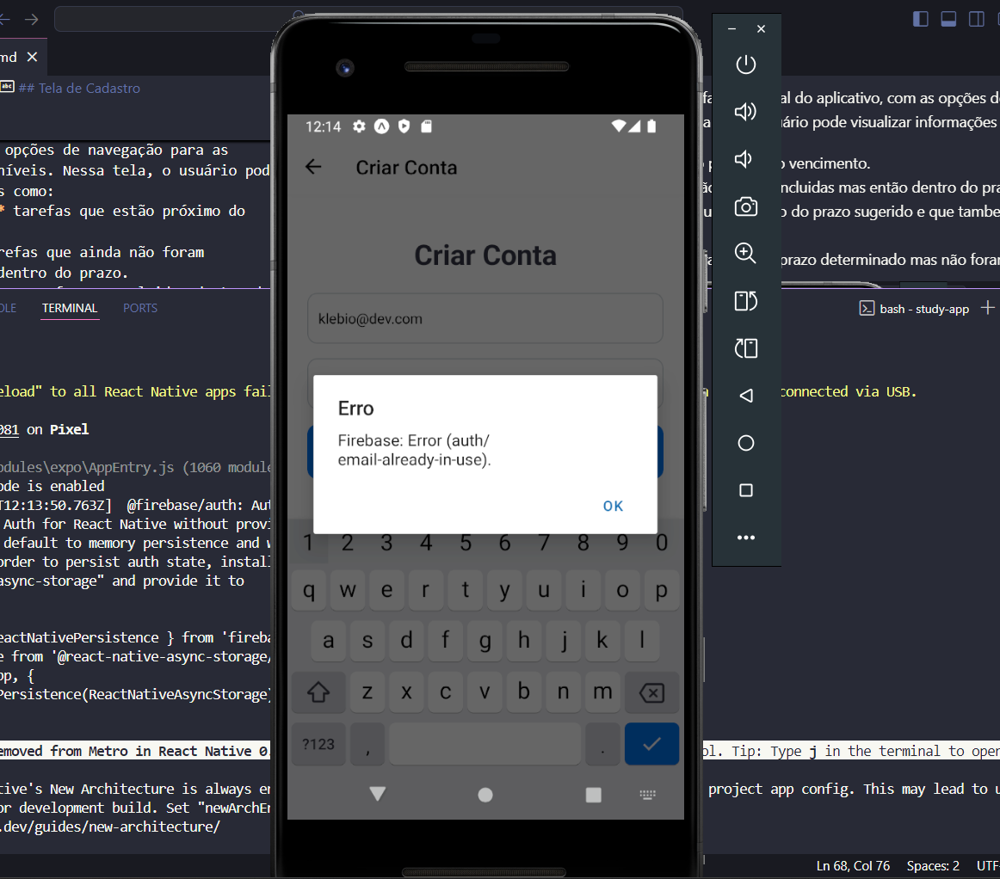

## Tela Principal

A tela exibida após o login mostra a interface principal do aplicativo, com as opções de navegação para as funcionalidades disponíveis. Nessa tela, o usuário pode visualizar informações como:
### Tarefas a Vencer
Esta seção exibe as tarefas que estão prestes a vencer. Aqui, o usuário pode ver os cartões que precisam de atenção urgente ou estão próximos da data limite.
Exibe a quantidade de tarefas que estão prestes a vencer é exibida nesta seção.

### Em Progresso
Aqui são listadas as tarefas que estão sendo trabalhadas no momento.

### Concluído
Esta seção exibe as tarefas que foram finalizadas com sucesso.

### Backlog
A seção de backlog contém tarefas que ainda não foram iniciadas.

### Adicionar Cartão
No final da tela, o usuário pode clicar no botão **Adicionar Cartão** para criar uma nova tarefa e organizá-la nas seções apropriadas.

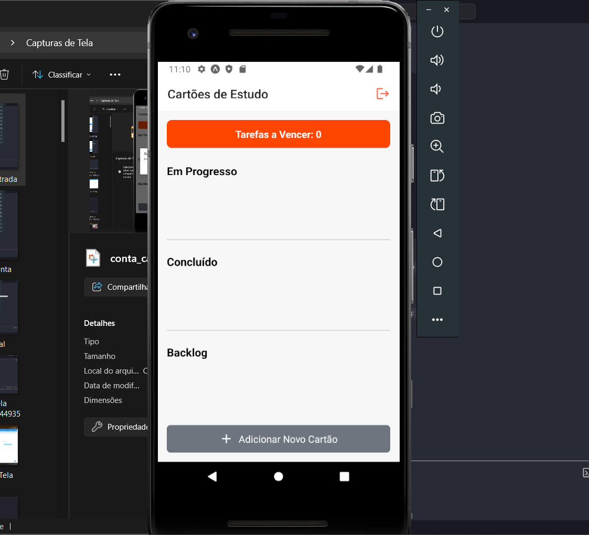

## Criando Cartão de Estudos

Na tela de criação de cartão, o usuário pode adicionar um novo cartão, preenchendo os campos obrigatórios com as informações necessárias. O formulário inclui campos para o título, descrição, data, hora e status, permitindo ao usuário personalizar o cartão antes de salvá-lo.

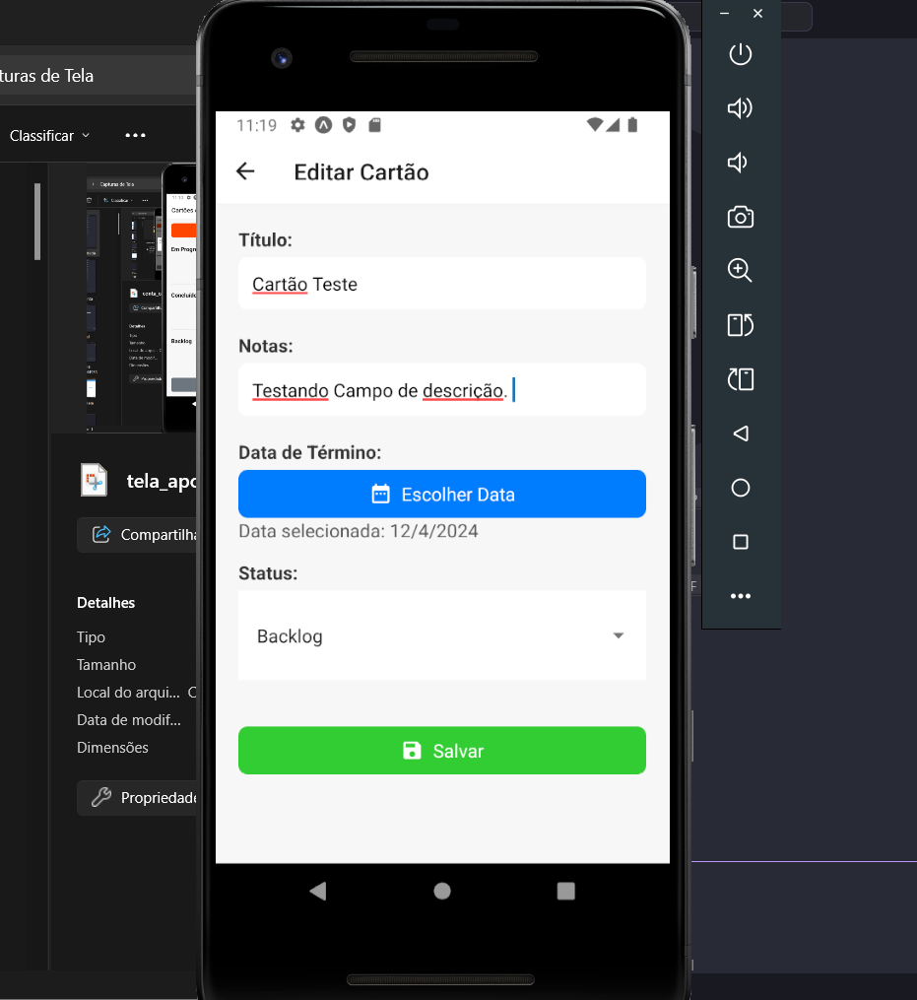

## Adicionando Data e Hora ao Cartão

Ao criar um cartão, o usuário tem a opção de escolher uma data e hora para associar ao cartão. Quando o usuário clica no botão *"Escolher Data"*, um calendário é exibido, permitindo a seleção da data e horário desejados.

- **Escolher Data**: Ao clicar no botão "Escolher Data", o calendário é aberto, permitindo ao usuário selecionar uma data.

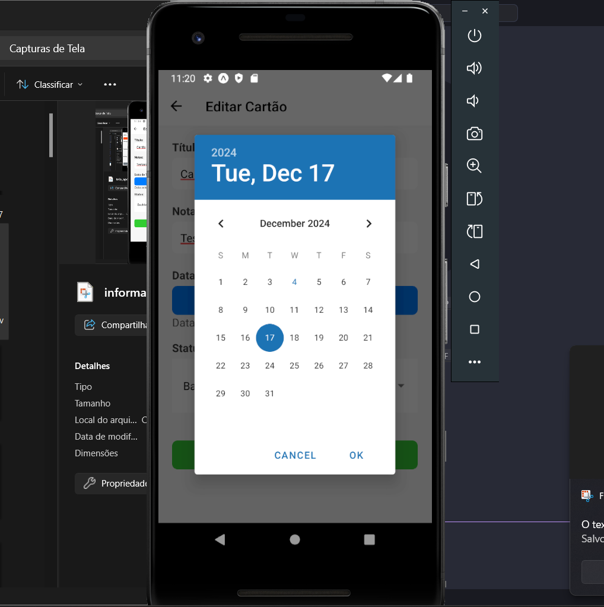

- **Selecionando Hora**: Após escolher a data, será exibido um relógio para o usuário pode escolher a hora desejada para a tarefa associada ao cartão.

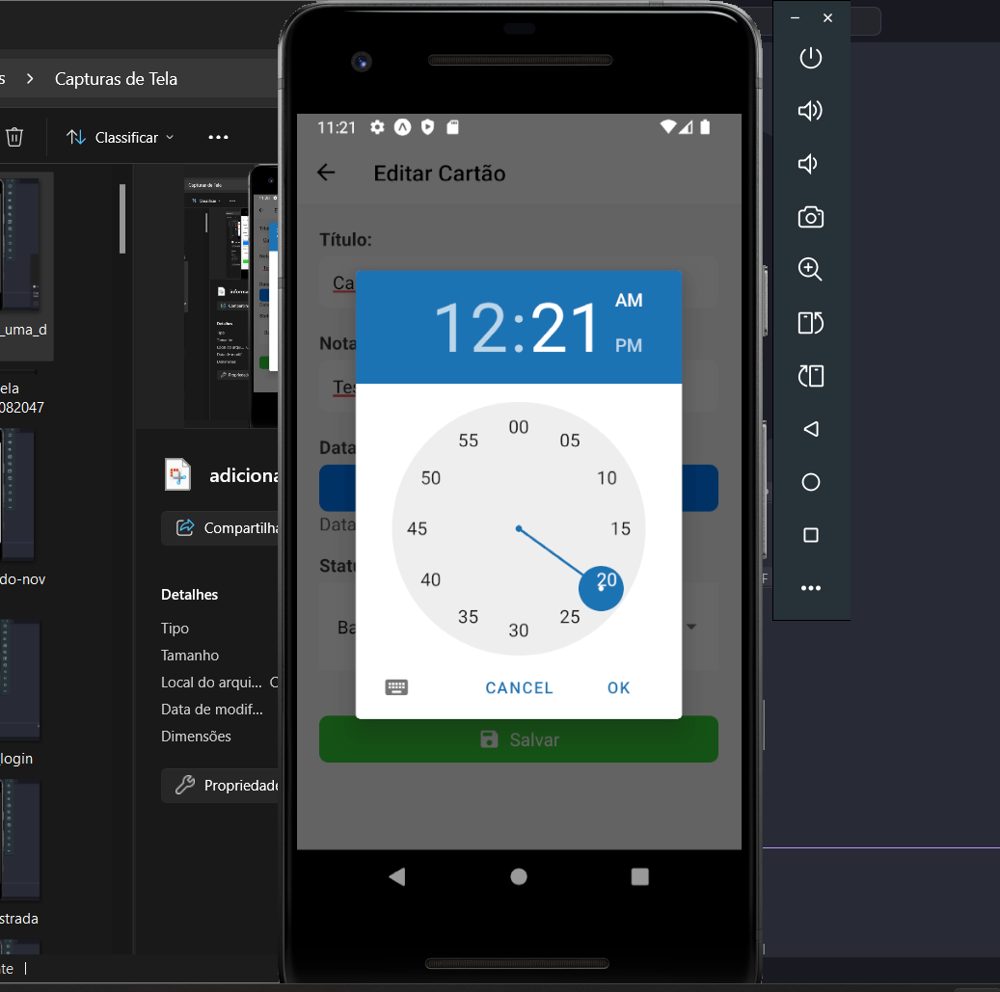

- **Exibição no Formulário**: A data e hora escolhidas são automaticamente inseridas no formulário do cartão.

## Selecionando o Status do Cartão

Durante a criação do cartão, o usuário pode definir o status do cartão clicando no campo **Status** e escolhendo uma das três opções disponíveis:

- **Backlog**: Indica que o cartão está na fila para ser iniciado.
- **Em Progresso**: Significa que o cartão está sendo trabalhado no momento.
- **Concluído**: Mostra que o cartão foi finalizado e a tarefa foi concluída.

O status selecionado ajudará a organizar os cartões em seus respectivos campos e acompanhar o progresso das tarefas relacionadas.

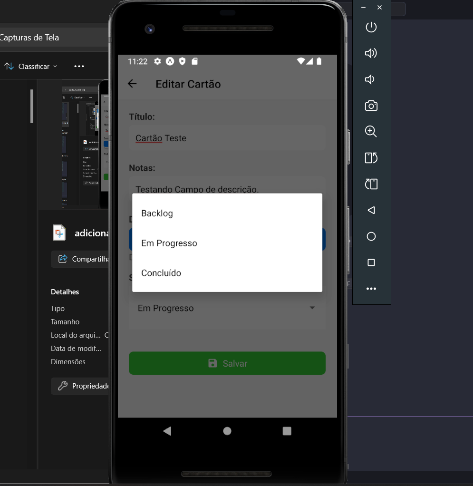

## Tela Principal com Campos Preenchidos

A tela principal exibe todos os campos preenchidos com cartões, organizados de acordo com seu status. Cada seção contém cartões representando as tarefas, organizados por seu respectivo estado.

### Tarefas a Vencer
A seção **Tarefas a Vencer** exibe a quatidade de tarefas próximas da data limite.

- Ao Clicar em **Tarefas a Vencer** os cartões de tarefas que precisam ser realizadas em breve são exibidos nesta seção, com informações detalhadas sobre as tarefas a vencer.

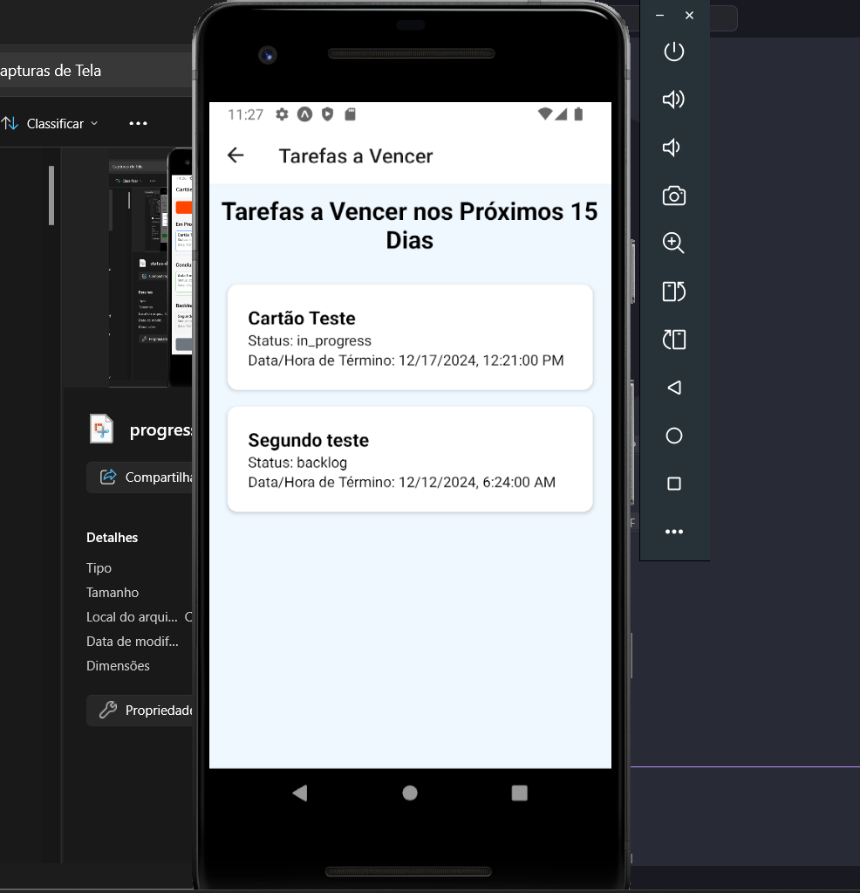

### Em Progresso
A seção **Em Progresso** mostra as tarefas que estão sendo ativamente trabalhadas.

- As tarefas exibidas na seção **Em Progresso** possuem os icones de *caneta* e *lixeira* ao clicar você pode:
  - #### *canete*: editar seu cartão.
  - #### *lixeira*: excluir seu cartão.
  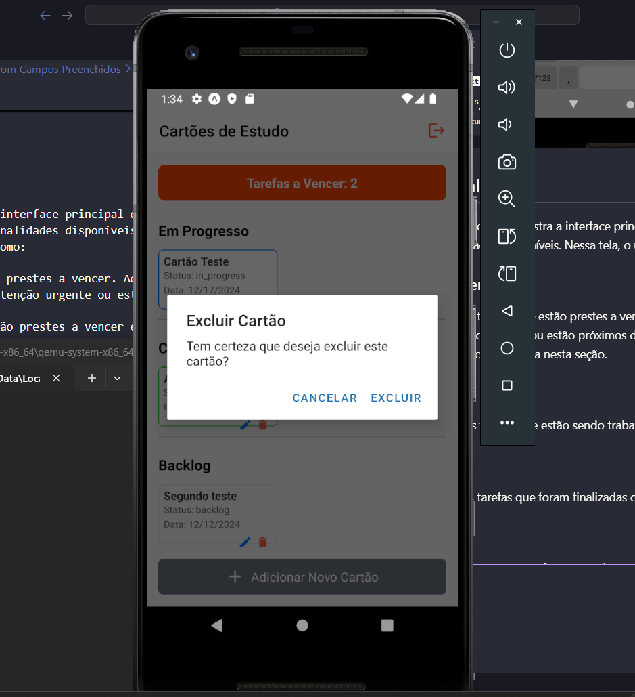 

### Concluído
A seção **Concluído** apresenta as tarefas que já foram finalizadas.

- Os cartões de tarefas concluídas são exibidos nesta seção, indicando as tarefas que foram completadas com sucesso.
- Os cartões finalizados podem ser editados e excluidos.

### Backlog
A seção **Backlog** exibe as tarefas que ainda estão aguardando para ser iniciadas.

- Cartões de tarefas que ainda não foram iniciadas são apresentados aqui, representando tarefas planejadas para o futuro.

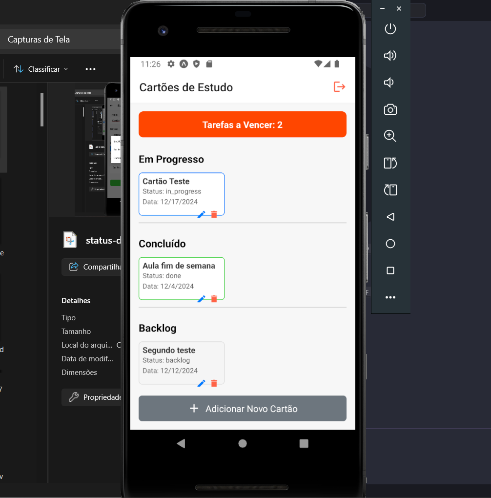

## Bibliotecas Utilizadas

### Dependências

- **@babel/core**: Biblioteca central do Babel, usada para compilar o código JavaScript moderno para uma versão compatível com navegadores e dispositivos.
- **@expo/metro-runtime**: Ferramenta para executar o Metro bundler no ambiente do Expo.
- **@react-native-async-storage/async-storage**: Biblioteca para armazenamento de dados localmente no dispositivo, usada para salvar informações persistentes.
- **@react-native-picker/picker**: Componente que permite criar pickers (seletores) para selecionar opções em dispositivos móveis.
- **@react-navigation/native-stack**: Biblioteca para navegação por pilha de telas no React Navigation.
- **@react-navigation/native**: Biblioteca principal do React Navigation, responsável pela navegação entre diferentes telas no aplicativo.
- **@react-navigation/stack**: Biblioteca do React Navigation para navegação baseada em pilha de telas.
- **expo-local-authentication**: Biblioteca para autenticação local, como reconhecimento facial ou impressão digital, utilizando a funcionalidade do dispositivo.
- **expo-status-bar**: Componente do Expo para controlar a barra de status no topo do aplicativo.
- **expo**: Framework e plataforma para desenvolver aplicativos móveis com React Native de forma mais simples e rápida.
- **firebase**: Biblioteca oficial para integrar o Firebase ao seu aplicativo, oferecendo recursos como autenticação, banco de dados e notificações.
- **react-dom**: Biblioteca necessária para renderizar componentes React no ambiente da web.
- **react-native-async-storage**: Versão do Async Storage compatível com o React Native, para armazenamento local de dados.
- **react-native-dotenv**: Biblioteca para carregar variáveis de ambiente em projetos React Native.
- **react-native-modal-datetime-picker**: Componente para exibir um picker de data e hora em formato de modal.
- **react-native-safe-area-context**: Biblioteca para garantir que o conteúdo do aplicativo seja exibido dentro da área segura da tela, considerando bordas e entalhes.
- **react-native-screens**: Biblioteca que melhora a performance de navegação no React Native ao gerenciar as telas de forma otimizada.
- **react-native-vector-icons**: Conjunto de ícones vetoriais personalizáveis para uso no React Native.
- **react-native-web**: Permite que componentes React Native sejam usados em uma aplicação web.
- **react-native**: Framework principal para desenvolvimento de aplicativos móveis usando JavaScript e React.
- **react**: Biblioteca para criação de interfaces de usuário baseadas em componentes, o núcleo do React Native.

### Dependências de Desenvolvimento

- **react-native-dotenv**: Ferramenta que permite usar variáveis de ambiente no React Native, útil para armazenar chaves e credenciais de forma segura.

Essas bibliotecas são essenciais para o funcionamento do projeto, proporcionando tanto funcionalidades fundamentais como navegação, autenticação e armazenamento, quanto ferramentas de desenvolvimento que tornam o projeto mais flexível e otimizado.

## Como rodar a aplicação

### Clonar o repositório
git clone https://github.com/KlebioCosta/react-native-uniesp-2024/tree/main/study-app

### Navegar até o diretório do projeto
cd study-app

### Instalar as dependências
npm install

### Rodar o projeto localmente
**npm start** *ou* **npx expo start**
